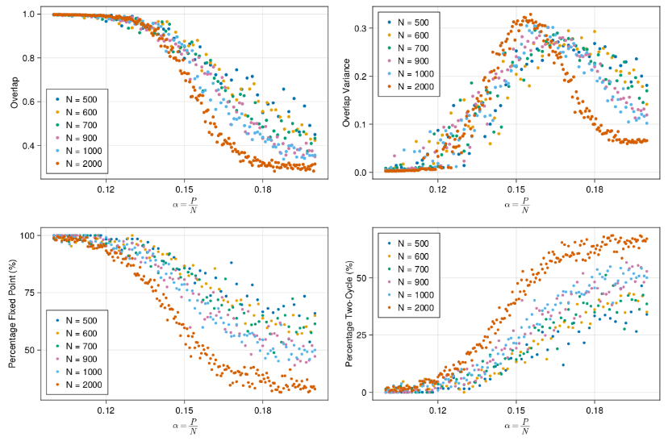

## Phase transitions in Hopfield Networks

The main objective of this code is to explore the behavior of Hopfield Networks in retaining information (memories) relative to their size \( N \). Hopfield Networks are artificial neural networks trained using associative memory mechanisms, enabling them to recover memories even when "corrupted" by noise. These networks find applications in various domains such as pattern recognition and optimization problems.

For a deeper understanding of Hopfield Networks, refer to the Wikipedia page on [Hopfield Networks](https://en.wikipedia.org/wiki/Hopfield_network).

One intriguing feature of these networks is the occurrence of a critical point as the number of stored patterns increases. Beyond this critical point, the network fails to recover patterns effectively, resembling phase transitions observed in magnetic systems. Extensive studies have been conducted on this behavior, as referenced in the following papers:

1. Daniel Volk (1998): "On the Phase Transition of Hopfield Networks — Another Monte Carlo Study"
2. Violla Folli et al (2016): "On the maximum storage capacity of the Hopfield Model"

### Organization of the project

Hopfield Networks are implemented using the Julia Programming Language, chosen for its speed and simplicity. The core code for running simulations is contained in **run_sim_hopfield.jl**. Additionally, a bash file named **reproduce_results** has been provided to facilitate rerunning all simulations. Alternatively, pre-simulated results are available in the **results folder** for direct analysis in the **analysis.ipynb** Jupyter notebook.

### Results

To analyze the capacity of the Hopfield network, networks of size $N$ were trained with a varying number of memories $P$. The probability of recovery was then analyzed, representing the percentage of patterns correctly recovered. 

In this analysis, the network was trained as a dynamical system where the correct memories act as fixed points of the system. However, as the number of memories increases, the fixed points become mixed up, leading to the appearance of cycles within the system.

All these properties were analyzed as functions of the parameter $\alpha = \frac{P}{N} $, representing the ratio of memories to network size. This parameter allows for the examination of network behavior as the memory load relative to network capacity varies.

